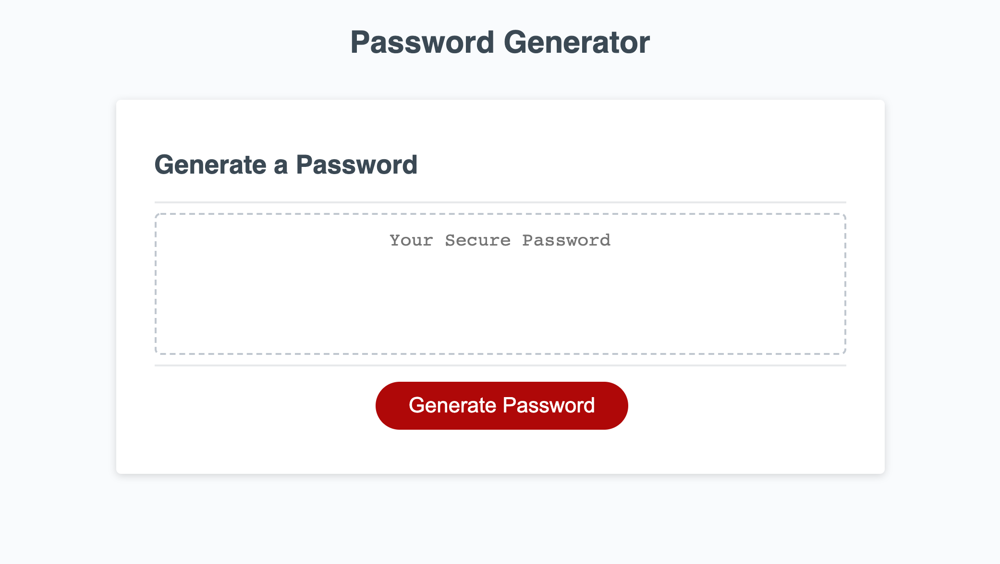
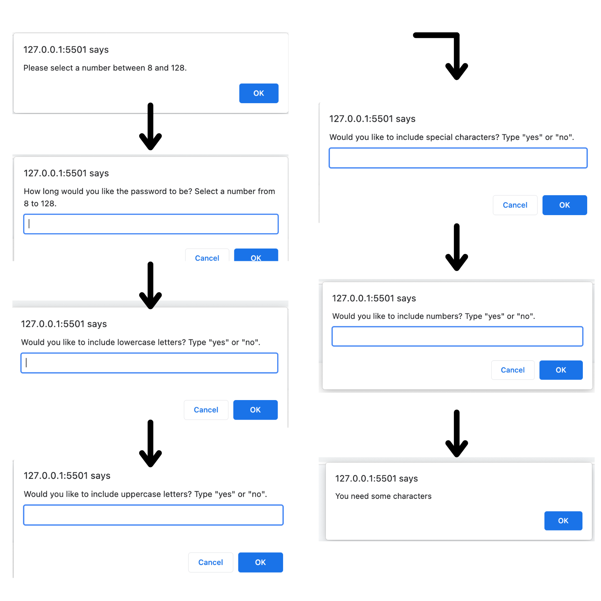
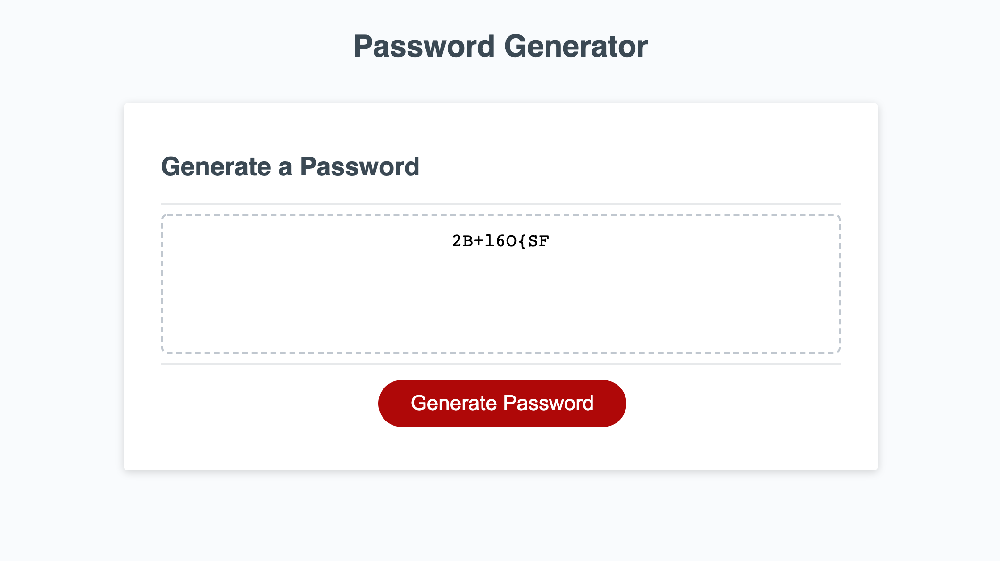

# 3-JavaScript-Password-Generator

## Task

My task was to modify starter code to create an application that enables employees to generate random passwords based on critieria that they have selected. 

&nbsp;
## User Story
 
```
AS AN employee with access to sensitive data
I WANT to randomly generate a password that meets certain criteria
SO THAT I can create a strong password that provides greater security
```

## Acceptance Criteria

```
GIVEN I need a new, secure password
WHEN I click the button to generate a password
THEN I am presented with a series of prompts for password criteria
WHEN prompted for password criteria
THEN I select which criteria to include in the password
WHEN prompted for the length of the password
THEN I choose a length of at least 8 characters and no more than 128 characters
WHEN asked for character types to include in the password
THEN I confirm whether or not to include lowercase, uppercase, numeric, and/or special characters
WHEN I answer each prompt
THEN my input should be validated and at least one character type should be selected
WHEN all prompts are answered
THEN a password is generated that matches the selected criteria
WHEN the password is generated
THEN the password is either displayed in an alert or written to the page
```

&nbsp;
## The Planning Process

Before I started coding, I made sure to write out Pseudo Code. This was immensely helpful because it allowed me to stay organized. I also used it as a reference when I got stuck.

> Pseudo Code

````javascript
/* When user clicks on the "Generate Password" button 
    - Prompt length of characters (8-128)
            - if user selects x<8 or x>128, prompt again

    - At least 1 of the below needs to be selected:
        - Prompt: include lower case (y or n)
            - if yes, concat to userArray. If no, don't
         - Prompt: include upper case (y or n)
            - if yes, concat to userArray. If no, don't 
        - Prompt: include special characters (y or n)
            - if yes, concat to userArray. If no, don't 

    - Shuffle userArray

    - Slice the shuffled array by the amount the user selected

     - Generate password written on page in the correct area */

````
## Mock-Up

&nbsp;
> Start



&nbsp;
> Path



&nbsp;
> End



&nbsp;
## Link

The link to the deployed page is https://edytatar.github.io/3-JavaScript-Password-Generator/.
